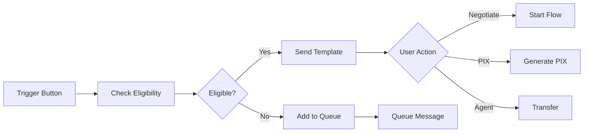

# 🎯 Guia: Flow Builder de Negociação via Template

## 📋 Visão Geral

Agora você pode criar flows de negociação diretamente no **Flow Builder visual** usando templates pré-configurados e nodes especializados. Este sistema permite arrastar e conectar componentes para criar automações complexas de cobrança.

## 🚀 Como Usar o Template de Negociação

### **1. Acessar o Flow Builder**

```
http://localhost:3000/flows/create
```

### **2. Carregar Template de Negociação**

1. **Clique em "📋 Templates"** no header do builder
2. **Selecione "Template de Negociação"** 
3. **Clique em "Carregar Template"**
4. **Template será automaticamente carregado** no canvas

### **3. Nodes Especializados Incluídos**

#### **📱 Template de Negociação**
- **Função**: Envia template WhatsApp personalizado com dados do cliente
- **Configurações**:
  - Nome do cliente: `{{customer.name}}`
  - Valor da dívida: `{{debt.amount}}`
  - Data de vencimento: `{{debt.due_date}}`
  - Botões configuráveis (Negociar, PIX, Atendente)

#### **👥 Fila de Negociação**
- **Função**: Adiciona cliente à fila de atendimento baseado em critérios
- **Configurações**:
  - Tipo: Automática, Manual, Prioritária
  - Prioridade: Baixa, Média, Alta, Urgente
  - Departamento: Cobrança, Financeiro, etc.
  - Critérios: Valor mínimo, dias em atraso, score

#### **⚡ Iniciar Negociação**
- **Função**: Dispara flow de negociação automatizado
- **Configurações**:
  - Flow ID: `negotiation_flow`
  - Descontos automáticos: 10%, 20%, 30%
  - Cliente ID e valor automáticos

## 🎨 Personalizando o Template

### **Configurar Template de Negociação**

1. **Clique no node "Template Negociação"**
2. **Clique no ícone "⚙️" (Settings)**
3. **Configure**:
   ```
   Cliente: João Silva
   Valor: R$ 150,00
   Vencimento: 2024-01-15
   ```
4. **Personalize botões**:
   - Texto: "💬 Negociar Agora"
   - Ação: `start_flow`
   - Payload: `negotiation_flow`

### **Configurar Fila de Negociação**

1. **Clique no node "Fila de Negociação"**
2. **Configure critérios**:
   ```
   Valor mínimo: R$ 100,00
   Dias em atraso: 30+ dias
   Score mínimo: 500
   Departamento: Cobrança
   ```
3. **Definir prioridade**:
   - `🔥 Urgente`: > R$ 1.000
   - `⚡ Alta`: > R$ 500
   - `⭐ Média`: > R$ 100

## 🔌 Conectando os Nodes

### **Fluxo Completo de Negociação**



### **Conectar Manualmente**

1. **Arrastar do handle** direito do node origem
2. **Soltar no handle** esquerdo do node destino
3. **Configurar condições** se necessário

## 📊 Testando o Flow

### **1. Teste Integrado**

```tsx
// No builder, clique em "Test" ou use:
const testFlow = async () => {
  const response = await fetch('/api/flows/test-template', {
    method: 'POST',
    body: JSON.stringify({
      template_id: 'negotiation_template',
      contact_id: '5511999999999'
    })
  })
}
```

### **2. Teste via API**

```bash
# Simular clique no botão do template
curl -X POST http://localhost:8080/api/v1/webhook/simulate-negotiation \
  -H "Content-Type: application/json" \
  -d '{
    "contact_id": "5511999999999",
    "selected_option": "discount_30"
  }'
```

### **3. Monitorar Execução**

```bash
# Ver sessões ativas
curl http://localhost:8080/api/v1/flows/sessions/active

# Estatísticas
curl http://localhost:8080/api/v1/flows/sessions/stats
```

## 🛠️ Exemplos Práticos

### **Cenário 1: Cliente Elegível**

```
1. 📱 Cliente recebe template
2. ✅ Sistema verifica elegibilidade (API)
3. 📋 Template enviado com 3 botões
4. 💬 Cliente clica "Negociar"
5. 🤖 Flow de negociação inicia
6. 📊 Opções apresentadas (30%, 20%, 10%)
7. 💳 Link de pagamento gerado
```

### **Cenário 2: Cliente Não Elegível**

```
1. 📱 Cliente recebe template
2. ❌ Sistema rejeita (valor muito baixo)
3. 👥 Cliente adicionado à fila manual
4. 📨 Mensagem de aguardo enviada
5. 🕐 Agente atenderá em 2h
6. 📞 Contato humano realizado
```

### **Cenário 3: Cliente Quer PIX**

```
1. 📱 Cliente recebe template
2. 💳 Cliente clica "Pagar PIX"
3. 🔄 API gera código PIX
4. 📱 Código enviado via WhatsApp
5. ⏰ Válido por 30 minutos
6. ✅ Pagamento confirmado automaticamente
```

## 🎯 Configurações Avançadas

### **Critérios de Elegibilidade**

```json
{
  "eligibility_criteria": {
    "min_amount": 50.00,
    "max_overdue_days": 180,
    "min_customer_score": 300,
    "blacklist_check": true,
    "payment_history": "good"
  }
}
```

### **Regras da Fila**

```json
{
  "queue_settings": {
    "auto_assign": true,
    "max_queue_time_hours": 24,
    "escalation_rules": {
      "high_value": { "amount": 1000, "priority": "urgent" },
      "vip_customer": { "score": 800, "priority": "high" }
    }
  }
}
```

### **Opções de Negociação**

```json
{
  "negotiation_options": {
    "auto_discounts": [30, 20, 10],
    "installment_options": [2, 3, 6],
    "max_discount": 40,
    "min_payment": 50.00,
    "payment_methods": ["pix", "card", "boleto"]
  }
}
```

## 📱 Interface do Template WhatsApp

### **Template Enviado**

```
💰 Pendência Financeira

Olá João Silva!

Você tem uma pendência de R$ 150,00 em aberto.

Que tal negociarmos uma condição especial para você?

[💬 Negociar] [💳 Pagar PIX] [🧑‍💼 Atendente]

PyTake - Soluções em cobrança
```

### **Após Clicar "Negociar"**

```
🤝 Olá João! Vamos negociar sua pendência de R$ 150,00.
Estou aqui para encontrar a melhor solução para você!

📋 Opções de Negociação
Escolha a melhor opção para quitar sua pendência:

💰 Desconto à Vista
• 30% de desconto - Pagamento hoje - R$ 105,00
• 20% de desconto - Pagamento até 3 dias - R$ 120,00
• 10% de desconto - Pagamento até 7 dias - R$ 135,00

💳 Parcelamento
• 2x sem juros - 2 parcelas de R$ 75,00
• 3x com juros - 3 parcelas de R$ 55,00

🎯 Outras Opções
• Fazer proposta - Sugira um valor ou condição
• Falar com atendente - Conversar com especialista
```

## 🔧 Integração com APIs

### **APIs Necessárias**

```bash
# Backend APIs
POST /api/customers/{id}/eligibility    # Verificar elegibilidade
POST /api/negotiation/queue            # Adicionar à fila
POST /api/flows/start                  # Iniciar flow
POST /api/payments/generate-pix        # Gerar PIX
POST /api/agents/transfer              # Transferir atendente

# Frontend APIs
POST /api/flows/test-template          # Testar template
GET  /api/flows/templates              # Listar templates
POST /api/flows/save                   # Salvar flow customizado
```

### **Webhook WhatsApp**

```bash
# Configurar webhook apontando para:
https://seu-dominio.com/api/v1/webhook/whatsapp

# Headers necessários:
X-Hub-Signature-256: sha256=...
Content-Type: application/json
```

## 📈 Métricas e Monitoramento

### **KPIs do Template**

- **Taxa de Clique**: % que clica nos botões
- **Conversão por Botão**: Negociar vs PIX vs Atendente
- **Taxa de Conclusão**: % que finaliza negociação
- **Valor Médio Recuperado**: Valor arrecadado por flow
- **Tempo Médio**: Duração da negociação

### **Dashboard Sugerido**

```json
{
  "templates_sent": 1250,
  "clicks": {
    "negotiate": 750,
    "pix": 300,
    "agent": 200
  },
  "conversion_rate": 60,
  "avg_recovery_value": 180.50,
  "queue_performance": {
    "avg_wait_time": "1.5 hours",
    "agent_resolution_rate": 85
  }
}
```

## 🚀 Próximos Passos

1. **Carregar Template**: Use o botão no Flow Builder
2. **Personalizar**: Configure valores e critérios
3. **Testar**: Use a função de teste integrada
4. **Deploy**: Salve e ative o flow
5. **Monitorar**: Acompanhe métricas de performance

---

**Agora você tem um sistema completo de negociação visual!** 🎯

Configure uma vez, reutilize infinitas vezes, e converta mais clientes com automação inteligente.