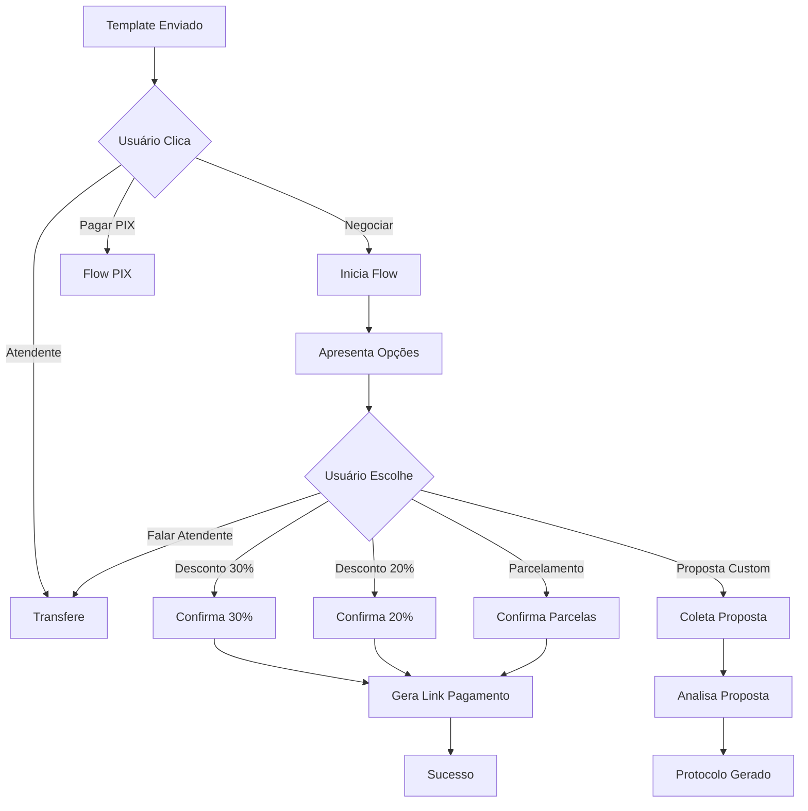

# 🤝 Guia do Flow de Negociação PyTake

## 📋 Visão Geral

O **Flow de Negociação** é um sistema automatizado para negociar pendências financeiras via WhatsApp. Permite oferecer descontos, parcelamentos e opções personalizadas de forma inteligente e estruturada.

## 🎯 Como Funciona

### 1. **Template Inicial**
```json
{
  "name": "payment_negotiation",
  "components": [
    {
      "type": "body",
      "text": "Olá {{customer_name}}!\n\nVocê tem uma pendência de R$ {{amount}} em aberto.\n\nQue tal negociarmos uma condição especial?"
    },
    {
      "type": "buttons",
      "buttons": [
        {
          "reply": {
            "id": "start_flow:negotiation_flow",
            "title": "💬 Negociar"
          }
        },
        {
          "reply": {
            "id": "pix_payment", 
            "title": "💳 Pagar PIX"
          }
        },
        {
          "reply": {
            "id": "transfer:billing_agent",
            "title": "🧑‍💼 Atendente"
          }
        }
      ]
    }
  ]
}
```

### 2. **Fluxo de Negociação**



## 🚀 Implementação

### **1. Enviando Template de Negociação**

```bash
curl -X POST http://localhost:8080/api/v1/webhook/send-negotiation-template \
  -H "Content-Type: application/json" \
  -H "Authorization: Bearer your-jwt-token" \
  -d '{
    "contact_id": "5511999999999",
    "customer_name": "João Silva",
    "amount": "150.00"
  }'
```

### **2. Webhook Processing**

O sistema automaticamente processa quando o usuário clica em "Negociar":

```json
{
  "object": "whatsapp_business_account",
  "entry": [{
    "changes": [{
      "value": {
        "messages": [{
          "from": "5511999999999",
          "interactive": {
            "button_reply": {
              "id": "start_flow:negotiation_flow",
              "title": "💬 Negociar"
            }
          }
        }]
      }
    }]
  }]
}
```

### **3. Flow Nodes Principais**

#### **Node de Boas-vindas**
```json
{
  "id": "welcome_negotiation",
  "type": "message",
  "config": {
    "content": "🤝 Olá! Vamos negociar sua pendência de R$ {{amount}}. Estou aqui para encontrar a melhor solução!"
  },
  "next": "show_negotiation_options"
}
```

#### **Node de Opções**
```json
{
  "id": "show_negotiation_options",
  "type": "interactive_list",
  "config": {
    "content": {
      "header": "Opções de Negociação",
      "body": "Escolha a melhor opção para quitar sua pendência:",
      "sections": [
        {
          "title": "Desconto à Vista",
          "rows": [
            {
              "id": "discount_30",
              "title": "30% de desconto",
              "description": "Pagamento até hoje - R$ {{discount_30_amount}}"
            },
            {
              "id": "discount_20", 
              "title": "20% de desconto",
              "description": "Pagamento até 3 dias - R$ {{discount_20_amount}}"
            }
          ]
        },
        {
          "title": "Parcelamento",
          "rows": [
            {
              "id": "installment_2x",
              "title": "2x sem juros",
              "description": "2 parcelas de R$ {{installment_2x_amount}}"
            }
          ]
        },
        {
          "title": "Outras Opções",
          "rows": [
            {
              "id": "custom_proposal",
              "title": "Fazer proposta",
              "description": "Sugira um valor ou condição"
            }
          ]
        }
      ]
    }
  }
}
```

## 🧪 Testando o Sistema

### **1. Teste Automatizado**

```bash
# Execute o script de teste
node test_negotiation_flow.js
```

### **2. Teste Manual via API**

```bash
# Simular cenário completo
curl -X POST http://localhost:8080/api/v1/webhook/simulate-negotiation \
  -H "Content-Type: application/json" \
  -d '{
    "contact_id": "5511999999999",
    "selected_option": "discount_30"
  }'
```

### **3. Cenários de Teste**

| Cenário | Opção | Resultado Esperado |
|---------|-------|-------------------|
| Desconto 30% | `discount_30` | Gera link com 30% desconto |
| Desconto 20% | `discount_20` | Gera link com 20% desconto |
| Parcelamento 2x | `installment_2x` | Gera link parcelado |
| Proposta Custom | `custom_proposal` | Coleta proposta e gera protocolo |
| Atendente | `talk_to_agent` | Transfere para humano |

## 💻 Frontend Builder

### **Componente React**

```tsx
import { NegotiationFlowBuilder } from '@/components/flow-editor/negotiation-flow-builder'

export function FlowBuilderPage() {
  const handleFlowGenerated = (flow: any) => {
    console.log('Flow gerado:', flow)
    // Salvar flow no backend
  }

  return (
    <NegotiationFlowBuilder 
      onFlowGenerated={handleFlowGenerated}
    />
  )
}
```

### **Funcionalidades do Builder**

- ✅ **Configuração Visual**: Interface intuitiva para configurar descontos e parcelamentos
- ✅ **Preview em Tempo Real**: Visualização do flow sendo criado
- ✅ **Teste Integrado**: Botão para testar o flow diretamente
- ✅ **Export JSON**: Exportar configuração para backup
- ✅ **Validação**: Verificação automática de configurações

## 📊 Monitoramento

### **Verificar Sessões Ativas**

```bash
curl http://localhost:8080/api/v1/flows/sessions/active
```

```json
[
  {
    "id": "session-uuid",
    "contact_id": "5511999999999",
    "current_node_id": "show_negotiation_options",
    "status": "waiting",
    "variables": {
      "amount": "150.00",
      "discount_30_amount": "105.00"
    }
  }
]
```

### **Estatísticas de Uso**

```bash
curl http://localhost:8080/api/v1/flows/sessions/stats
```

```json
{
  "total_active": 5,
  "waiting_for_input": 3,
  "executing": 2,
  "by_flow": {
    "negotiation_flow": 3,
    "pix_payment_flow": 2
  }
}
```

## 🔧 Configurações Avançadas

### **Variáveis do Flow**

```json
{
  "amount": "150.00",
  "customer_name": "João Silva",
  "discount_30_amount": "105.00",
  "discount_20_amount": "120.00",
  "installment_2x_amount": "75.00",
  "api_token": "{{jwt_token}}",
  "contact_id": "{{contact_id}}"
}
```

### **Timeouts e Limites**

```json
{
  "settings": {
    "timeout_minutes": 60,
    "max_iterations": 15,
    "fallback_node": "transfer_to_agent"
  }
}
```

### **Integrações API**

#### **Gerar Link de Pagamento**
```json
{
  "id": "generate_payment_link",
  "type": "api",
  "config": {
    "endpoint": "/api/payments/generate-link",
    "method": "POST",
    "body": {
      "contact_id": "{{contact_id}}",
      "amount": "{{final_amount}}",
      "description": "Pagamento negociado - {{selected_option}}"
    }
  }
}
```

#### **Salvar Proposta Customizada**
```json
{
  "id": "process_custom_proposal",
  "type": "api", 
  "config": {
    "endpoint": "/api/negotiations/create",
    "method": "POST",
    "body": {
      "contact_id": "{{contact_id}}",
      "proposal": "{{custom_proposal}}",
      "original_amount": "{{amount}}"
    }
  }
}
```

## 🎨 Personalização

### **Customizar Mensagens**

```json
{
  "welcome_message": "🤝 Olá {{customer_name}}! Vamos negociar?",
  "discount_message": "🎉 Desconto de {{percentage}}% aplicado!",
  "installment_message": "📋 Parcelamento em {{parcels}}x configurado!",
  "success_message": "✅ Negociação confirmada! Link: {{payment_link}}"
}
```

### **Customizar Opções**

```json
{
  "discounts": [
    {"percentage": 30, "deadline": "hoje"},
    {"percentage": 20, "deadline": "3 dias"},
    {"percentage": 10, "deadline": "7 dias"}
  ],
  "installments": [
    {"parcels": 2, "interest": false},
    {"parcels": 3, "interest": true, "rate": 5},
    {"parcels": 6, "interest": true, "rate": 10}
  ]
}
```

## 🔍 Troubleshooting

### **Problemas Comuns**

| Problema | Causa | Solução |
|----------|-------|---------|
| Flow não inicia | Template payload incorreto | Verificar formato: `start_flow:negotiation_flow` |
| Sessão não encontrada | Redis desconectado | Verificar conexão Redis |
| Opções não aparecem | Configuração de lista inválida | Máximo 10 opções por lista |
| API error | Token inválido | Verificar JWT token |

### **Debug Mode**

```bash
RUST_LOG=debug cargo run
```

### **Logs Importantes**

```bash
# Sessões criadas
INFO: Flow session created: session-uuid for contact 5511999999999

# Nodes executados  
DEBUG: Executing node: show_negotiation_options for session: session-uuid

# Erros de validação
ERROR: Validation failed for input node: ask_custom_proposal
```

## 📈 Métricas de Sucesso

### **KPIs Recomendados**

- **Taxa de Conversão**: Usuários que completam negociação
- **Opção Mais Popular**: Qual desconto/parcelamento é mais escolhido
- **Tempo Médio**: Duração média das negociações
- **Taxa de Abandono**: Sessões que expiram sem conclusão

### **Dashboard Sugerido**

```json
{
  "total_negotiations": 150,
  "completed": 120,
  "conversion_rate": 80,
  "most_popular_option": "discount_20",
  "average_duration_minutes": 8,
  "abandonment_rate": 20
}
```

## 🚀 Próximos Passos

1. **Implementar IA**: Classificação automática de perfil do cliente
2. **A/B Testing**: Testar diferentes estratégias de desconto
3. **Integração CRM**: Sincronizar com sistemas de cobrança
4. **Relatórios**: Dashboard detalhado de performance
5. **Multi-canal**: Expandir para SMS, Email, etc.

---

**PyTake Flow de Negociação** - Automação inteligente para recuperação de crédito 🤝💰