# PyTake - WhatsApp Business Automation Platform

## 🚀 Visão Geral

PyTake é uma plataforma completa para automação de WhatsApp Business API, permitindo criar flows visuais, gerenciar conversas e automatizar atendimento ao cliente.

### ✨ Funcionalidades Principais

#### 🤖 Sistema de IA Inteligente
- **Análise de Sentimento em Tempo Real**: Detecção automática de satisfação do cliente
- **Classificação de Intenções**: Identificação inteligente do propósito das mensagens
- **Sugestões Automáticas**: Sistema de sugestões contextuais para agentes
- **Alertas de IA**: Notificações automáticas para situações críticas
- **Dashboard de Insights**: Análise completa com métricas de IA

#### 🔔 Sistema de Notificações Avançado
- **Centro de Notificações**: Interface completa com filtragem e categorização
- **Notificações em Tempo Real**: WebSocket + Service Worker + Push API
- **Alertas Inteligentes**: Baseados em análise de sentimento e prioridade
- **Configuração Granular**: Controle total sobre tipos, volumes e horários
- **Modo Não Perturbe**: Sistema inteligente de silenciamento

#### 🔒 Sistema de Backup e Recuperação
- **Backup Automático**: Agendamento inteligente com múltiplas frequências
- **Restauração Flexível**: Recuperação completa ou parcial de dados
- **Criptografia e Compressão**: Segurança e otimização de armazenamento
- **Monitoramento em Tempo Real**: Widget no dashboard com alertas de saúde
- **Armazenamento Híbrido**: Suporte local e nuvem com verificação de integridade

#### 🛡️ Sistema de Auditoria e Segurança
- **Log de Auditoria Completo**: Rastreamento detalhado de todas as ações
- **Dashboard de Auditoria**: Interface avançada com filtros e análises
- **Alertas de Segurança**: Monitoramento proativo de atividades suspeitas
- **Análise de Tendências**: Identificação de padrões e anomalias
- **Exportação de Logs**: Relatórios para compliance e análise

#### ⚙️ Sistema de Configurações Avançadas
- **Painel de Configurações**: Interface completa para todas as configurações
- **Monitoramento de Sistema**: Métricas em tempo real de CPU, memória e disco
- **Testes de Conectividade**: Validação automática de integrações
- **Configuração de IA**: Personalização completa do assistente inteligente
- **Importação/Exportação**: Backup e migração de configurações

#### 🎯 Sistema de Onboarding Inteligente
- **Configuração Guiada**: 7 etapas interativas para novos usuários
- **Progresso Visual**: Acompanhamento em tempo real da configuração
- **Templates Prontos**: Fluxos pré-configurados por segmento
- **Convite de Equipe**: Gestão simplificada de usuários e permissões
- **Widget de Progresso**: Acompanhamento no dashboard principal

#### 🚀 Automação e Flows
- **Editor Visual de Flows**: Interface drag-and-drop para criar automações
- **Fluxos Universais**: Automação que responde a qualquer mensagem automaticamente
- **Sistema de Prioridades**: Template direto > Palavra-chave > Fluxo universal
- **Verificação Janela 24h**: Detecção inteligente de janela de mensagem ativa
- **Transfer to Queue**: Componente para transferir conversas para atendimento humano

#### 👥 Gestão de Atendimento
- **Sistema de Filas Inteligentes**: Gerenciamento completo com priorização automática
- **Dashboard Individual de Agentes**: Interface personalizada para cada agente
- **Conversas em Tempo Real**: Sistema completo de chat com WebSocket
- **Análise de Performance**: Métricas detalhadas de produtividade

#### 🔧 Infraestrutura Robusta
- **WhatsApp Business API**: Integração completa com envio de mensagens e templates
- **Templates**: Criação e gestão de templates aprovados
- **Analytics Avançados**: Relatórios e métricas de desempenho com IA
- **Multi-tenant**: Suporte para múltiplos clientes

## 🛠 Stack Tecnológica

- **Backend**: Go com Gin framework
- **Frontend**: Next.js 15.4.6 com React Flow + TypeScript
- **Real-time**: WebSocket para comunicação bidirecional
- **Database**: PostgreSQL 15 com JSONB
- **Cache**: Redis 7
- **Proxy**: Nginx com SSL
- **Containerização**: Docker + Docker Compose

## 🏃‍♂️ Início Rápido

### Pré-requisitos
- Docker e Docker Compose
- Domínio configurado (opcional para desenvolvimento)

### Instalação

1. **Clone o repositório**
```bash
git clone <repository-url>
cd pytake-backend
```

2. **Configure as variáveis de ambiente**
```bash
cp .env.example .env
# Edite o arquivo .env com suas configurações
```

3. **Inicie os serviços**
```bash
docker-compose up -d
```

4. **Verifique o status**
```bash
docker-compose ps
```

### Acesso
- **Frontend**: http://localhost:3001 ou https://app.pytake.net
- **API**: http://localhost:8080 ou https://api.pytake.net

## 📊 Arquitetura

```
┌─────────────────┐    ┌─────────────────┐    ┌─────────────────┐
│   Next.js App   │────│   Go Backend    │────│  PostgreSQL DB  │
│  (Frontend)     │    │     (API)       │    │   + Redis       │
└─────────────────┘    └─────────────────┘    └─────────────────┘
         │                        │                        │
         └──────────── Nginx Proxy ──────────────────────────┘
```

## 🔧 Desenvolvimento

### Estrutura do Projeto

```
pytake-backend/
├── backend-go/          # API Go
├── frontend/            # Next.js App
├── migrations/          # Scripts SQL
├── docker-compose.yml   # Orquestração Docker
├── nginx.conf          # Configuração Nginx
└── certbot/            # Certificados SSL
```

### Scripts Úteis

```bash
# Ver logs em tempo real
docker-compose logs -f

# Rebuild de um serviço específico
docker-compose up -d --build frontend

# Executar migrations
docker exec pytake-postgres psql -U pytake_user -d pytake -f /migrations/script.sql

# Backup do banco
docker exec pytake-postgres pg_dump -U pytake_user pytake > backup.sql
```

## 🔄 Fluxos Universais

### Como Funcionam

Os **Fluxos Universais** são uma funcionalidade avançada que permite resposta automática a qualquer mensagem recebida no WhatsApp, seguindo uma hierarquia de prioridades:

#### Sistema de Prioridades
1. **Templates Diretos** (Prioridade Máxima)
   - Fluxos iniciados por templates enviados diretamente
   - Têm precedência sobre todos os outros tipos

2. **Fluxos por Palavra-chave** (Prioridade Alta)  
   - Ativados quando mensagem contém palavras-chave específicas
   - Exemplo: "ajuda", "suporte", "vendas"

3. **Fluxos Universais** (Fallback)
   - Executados quando não há template ativo nem palavra-chave
   - Resposta padrão para qualquer mensagem

#### Recursos Avançados

- **Verificação de Janela 24h**: Sistema detecta automaticamente se há janela ativa para envio direto
- **Fallback para Templates**: Usuários fora da janela recebem templates aprovados
- **Configuração de Expiração**: Tempo configurável (padrão: 10 minutos)
- **Logs Detalhados**: Rastreamento completo da execução dos fluxos

### Configuração

1. **Criar Fluxo Universal**
   - Acesse o editor de flows
   - Selecione "Fluxo Universal" como tipo
   - Configure nós: Trigger Universal → Verificação Janela → Mensagem/Template

2. **Componentes Disponíveis**
   - `trigger_universal`: Gatilho para qualquer mensagem
   - `logic_window_check`: Verificação da janela 24h
   - `msg_text`: Envio de mensagem direta
   - `msg_template`: Envio de template aprovado
   - `action_transfer_to_queue`: Transferência para fila de atendimento

## 🗄️ Estrutura do Banco de Dados

### Tabelas do Sistema de Filas

#### `queues`
Armazena configurações das filas de atendimento
- Configurações de tempo máximo e tamanho
- Horário de funcionamento
- Mensagens personalizadas

#### `agents`
Informações dos agentes/atendentes
- Status (online/offline/busy/away/break)
- Capacidade de atendimento simultâneo
- Skills e departamentos

#### `queue_items`
Itens aguardando ou em atendimento
- Posição na fila
- Prioridade e status
- Tempos de espera e atendimento

#### `queue_history`
Histórico completo de atendimentos
- Ações realizadas (entered/assigned/completed/abandoned)
- Métricas de tempo
- Avaliações e feedback

#### `queue_metrics`
Métricas agregadas por hora
- Total de entradas/saídas
- Tempos médios
- Taxa de abandono

## 📡 API Endpoints

### Conversas
- `GET /api/v1/conversations` - Listar conversas com filtros
- `GET /api/v1/conversations/{id}` - Obter conversa específica
- `GET /api/v1/conversations/{id}/messages` - Listar mensagens da conversa
- `POST /api/v1/conversations/{id}/messages` - Enviar mensagem
- `PATCH /api/v1/conversations/{id}/read` - Marcar como lida
- `PATCH /api/v1/conversations/{id}/status` - Atualizar status
- `GET /api/v1/conversations/stats` - Estatísticas de conversas
- `WS /api/v1/conversations/ws` - WebSocket para tempo real

### Flows
- `GET /api/v1/flows` - Listar flows
- `POST /api/v1/flows` - Criar flow
- `GET /api/v1/flows/{id}` - Obter flow
- `POST /api/v1/flows/{id}/test` - Testar flow

### WhatsApp
- `GET /api/v1/whatsapp/numbers` - Listar números
- `GET /api/v1/whatsapp/templates` - Listar templates
- `POST /api/v1/whatsapp/webhook` - Receber mensagens (interno)

### Filas de Atendimento
- `GET /api/v1/queues` - Listar todas as filas
- `POST /api/v1/queues` - Criar nova fila
- `GET /api/v1/queues/{id}` - Detalhes da fila
- `PUT /api/v1/queues/{id}` - Atualizar fila
- `GET /api/v1/queues/{id}/items` - Listar itens na fila
- `POST /api/v1/queues/{id}/assign` - Atribuir item a agente
- `GET /api/v1/queues/dashboard` - Métricas do dashboard

### Agentes
- `GET /api/v1/agents` - Listar agentes
- `PUT /api/v1/agents/{id}/status` - Atualizar status do agente
- `GET /api/v1/agents/{id}/queues` - Filas do agente

## 👨‍💼 Dashboard Individual de Agentes

### Visão Geral
Dashboard personalizado para cada agente de atendimento, fornecendo métricas individuais, gestão de metas e acompanhamento de desempenho em tempo real.

### Funcionalidades

#### 📊 Métricas Pessoais
- **Estatísticas do Dia**: Conversas atendidas, mensagens respondidas, tempo médio de resposta
- **Visão Semanal**: Totais acumulados, taxa de resolução, retenção de clientes
- **Relatório Mensal**: Performance geral, melhor dia, áreas de melhoria
- **Status em Tempo Real**: Carga atual, capacidade máxima, última atividade

#### 🎯 Gestão de Metas
- **Metas Configuráveis**: Conversas diárias, satisfação do cliente, tempo de resposta
- **Progresso Visual**: Barras de progresso com cálculos inteligentes
- **Categorias**: Conversas, satisfação, tempo de resposta, eficiência, qualidade
- **Acompanhamento**: Status de conclusão e deadlines

#### 📈 Linha do Tempo de Atividades
- **Eventos Rastreados**: Conversas iniciadas/finalizadas, metas alcançadas, feedback recebido
- **Mudanças de Status**: Histórico de alterações (online/ocupado/ausente/pausa)
- **Integração**: Conectado com sistema de conversas e notificações

#### 🔄 Gestão de Status
- **Estados Disponíveis**: Online, Ocupado, Ausente, Pausa, Offline
- **Atualização em Tempo Real**: Sincronização automática com backend
- **Horário de Trabalho**: Configuração de horários e fuso horário

### Arquitetura Técnica

```typescript
// Hook principal useAgentMetrics
interface AgentMetrics {
  todayStats: { conversationsHandled, messagesResponded, avgResponseTime, ... }
  weekStats: { totalConversations, avgSatisfaction, resolutionRate, ... }
  monthStats: { totalConversations, bestDay, achievements, ... }
  realTimeStats: { status, currentLoad, queuePosition, ... }
}
```

### Integração com APIs

- `GET /api/v1/agents/{id}/metrics` - Métricas do agente
- `GET /api/v1/agents/{id}/goals` - Metas configuradas
- `GET /api/v1/agents/{id}/activities` - Linha do tempo de atividades
- `PUT /api/v1/agents/{id}/status` - Atualização de status

## 🔔 Sistema de Notificações

### Visão Geral
Sistema completo de notificações em tempo real usando Web API, Service Worker e integração com WebSocket.

### Funcionalidades

#### 🌐 Web Notifications API
- **Permissões Automáticas**: Solicitação inteligente de permissões
- **Notificações Push**: Alertas mesmo com aba inativa
- **Configuração Granular**: Som, vibração, duração personalizáveis
- **Fallback Visual**: Notifications in-app quando permissão negada

#### 🔊 Service Worker
- **Background Processing**: Processamento em segundo plano
- **Offline Support**: Cache de notificações importantes
- **Sincronização**: Atualização quando conectividade retorna

#### ⚙️ Configurações Personalizáveis
- **Tipos de Notificação**: Novas mensagens, transferências de fila, metas alcançadas
- **Preferências de Som**: Diferentes sons por tipo de evento
- **Controle de Frequência**: Limites para evitar spam
- **Horários**: Modo silencioso em períodos específicos

### Integração com Sistema
```typescript
// Hook useNotifications
const { 
  showNotification,     // Exibir notificação
  requestPermission,    // Solicitar permissão
  isSupported,         // Verificar suporte
  config              // Configurações atuais
} = useNotifications()
```

## 💬 Sistema de Conversas em Tempo Real

### Visão Geral
Sistema completo de chat em tempo real com WebSocket para comunicação bidirecional entre agentes e clientes WhatsApp.

### Funcionalidades

#### 🔄 WebSocket Integration
- **Conexão Persistente**: Mantém conexão ativa com auto-reconexão
- **Autenticação Automática**: Token JWT enviado na conexão
- **Eventos em Tempo Real**: Mensagens, status e notificações instantâneas
- **Fallback Inteligente**: Atualização via polling quando WebSocket falha

#### 📱 Interface de Conversas
- **Lista de Conversas**: Visão geral com filtros e busca
- **Chat Individual**: Interface completa de mensagens
- **Indicadores Visuais**: Status de conexão, entrega e leitura
- **Sincronização**: Estado consistente entre múltiplas abas/dispositivos

#### 🚀 Recursos Avançados
- **Filtros Inteligentes**: Por status, agente, período
- **Busca Rápida**: Nome, telefone ou conteúdo das mensagens  
- **Contadores**: Mensagens não lidas em tempo real
- **Auto-scroll**: Scroll automático para novas mensagens
- **Estados de Mensagem**: Pending → Sent → Delivered → Read

### Arquitetura WebSocket

```javascript
// Eventos suportados pelo WebSocket
{
  "message_received": "Nova mensagem do cliente",
  "message_sent": "Mensagem enviada pelo agente",
  "message_status_updated": "Atualização de status da mensagem",
  "conversation_updated": "Mudança no status da conversa",
  "typing_start": "Cliente começou a digitar",
  "typing_stop": "Cliente parou de digitar"
}
```

### Fluxo de Mensagens


## 🎯 Sistema de Filas de Atendimento

### Visão Geral
O sistema de filas permite gerenciar atendimento humano integrado com automações WhatsApp.

### Funcionalidades

#### 📊 Dashboard de Filas
- **Visão em tempo real**: Monitor com métricas atualizadas
- **Gerenciamento de agentes**: Status online/offline/ocupado
- **Distribuição automática**: Algoritmo inteligente de distribuição
- **Priorização**: Suporte a níveis de prioridade (Normal, Alta, Urgente)

#### 🔄 Transfer to Queue
Componente no editor de fluxos para transferir conversas automaticamente:

1. **Configurações disponíveis**:
   - Seleção de fila de destino
   - Nível de prioridade
   - Mensagem personalizada ao transferir
   - Timeout e ações de fallback
   - Metadata adicional

2. **Uso no Flow**:
```javascript
// Exemplo de configuração do nó Transfer to Queue
{
  type: "action_transfer_to_queue",
  config: {
    queueId: "uuid-da-fila",
    queueName: "Suporte Técnico",
    priority: 1, // 0=Normal, 1=Alta, 2=Urgente
    message: "Você está sendo transferido para nosso suporte...",
    waitTimeoutMinutes: 30,
    fallbackAction: "abandon"
  }
}
```

#### 🎮 Monitor de Filas
Interface de 3 colunas para gerenciar atendimentos:
- **Coluna 1**: Lista de espera com posições
- **Coluna 2**: Atendimentos em andamento
- **Coluna 3**: Histórico recente

### Fluxo de Atendimento

```mermaid
graph LR
    A[Conversa WhatsApp] --> B[Flow Automático]
    B --> C{Precisa Humano?}
    C -->|Sim| D[Transfer to Queue]
    D --> E[Fila de Espera]
    E --> F[Distribuição Automática]
    F --> G[Agente Disponível]
    G --> H[Atendimento]
    C -->|Não| I[Continua Automação]
```



## 🔒 Configuração WhatsApp

1. **Obter Token**: Meta Business > WhatsApp Business API
2. **Configurar Webhook**: URL: `https://api.pytake.net/webhook/whatsapp`
3. **Verificar Token**: Configure no arquivo `.env`

## 🚢 Produção

### SSL/HTTPS
```bash
# Gerar certificados Let's Encrypt
./setup-letsencrypt.sh
```

### Monitoramento
```bash
# Status dos containers
docker stats

# Logs de erro
docker-compose logs --tail=100 backend
```

## 📋 Roadmap e Versioning

### 🚀 Versão Atual: v2.6.0

#### ✅ Implementado
- **v2.1.0**: Sistema completo de IA (Análise de Sentimento, Intenções, Sugestões)
- **v2.2.0**: Sistema de Notificações em Tempo Real (Centro de notificações + Alertas inteligentes)  
- **v2.3.0**: Sistema de Backup e Recuperação (Automático + Manual + Restauração flexível)
- **v2.4.0**: Sistema de Auditoria e Segurança (Logs completos + Dashboard + Alertas)
- **v2.5.0**: Sistema de Configurações Avançadas (Painel completo + Monitoramento + Testes)
- **v2.6.0**: Sistema de Onboarding Inteligente (Configuração guiada + Templates + Progresso visual)

#### 🔄 Próximas Versões

**v2.7.0 - Gamificação e Engajamento** (Próximo)
- Sistema de pontuação e ranking para agentes
- Conquistas e badges baseadas em performance
- Desafios e metas personalizáveis
- Dashboard de gamificação com progressão visual

**v2.8.0 - Relatórios e Analytics Avançados**
- Dashboards customizáveis com drill-down
- Relatórios automatizados por email
- Análise preditiva com Machine Learning
- Exportação em múltiplos formatos

**v2.9.0 - Integrações Empresariais**
- Conectores ERP (SAP, Oracle, Totvs)
- Integração com CRM (Salesforce, HubSpot)
- APIs RESTful para terceiros
- Webhooks avançados com retry logic

#### 🔮 Roadmap Futuro
- **Sistema de Relatórios Avançados**: Dashboards customizáveis com BI
- **Integrações ERP**: Conectores para sistemas empresariais
- **API de Terceiros**: SDK para desenvolvedores
- **Mobile App**: Aplicativo nativo para agentes
- **Multi-idiomas**: Suporte internacional completo

### 🔄 Histórico de Versões

**v2.6.0** (Atual)
- ✅ Sistema de onboarding com 7 etapas interativas
- ✅ Fluxos de configuração guiada para novos usuários
- ✅ Templates pré-configurados por segmento
- ✅ Widget de progresso no dashboard
- ✅ Convite automático de equipe

**v2.5.0**
- ✅ Painel de configurações avançadas completo
- ✅ Monitoramento de sistema em tempo real
- ✅ Testes de conectividade automatizados
- ✅ Importação/exportação de configurações
- ✅ Widget de status do sistema no dashboard

**v2.4.0**
- ✅ Sistema de auditoria com logs detalhados
- ✅ Dashboard de auditoria com filtros avançados
- ✅ Alertas de segurança automáticos
- ✅ Análise de tendências e anomalias
- ✅ Exportação de logs para compliance

**v2.3.0**
- ✅ Sistema de Backup completo com agendamento automático
- ✅ Restauração flexível (completa/parcial) 
- ✅ Widget de status no dashboard
- ✅ Monitoramento de saúde do sistema

**v2.2.0**
- ✅ Centro de notificações com filtragem
- ✅ Notificações baseadas em IA
- ✅ Sistema de configurações granulares
- ✅ Integração com Service Worker

**v2.1.0**
- ✅ Análise de sentimento em tempo real
- ✅ Classificação de intenções automática
- ✅ Sistema de sugestões contextuais
- ✅ Dashboard de insights de IA
- ✅ Alertas automáticos para situações críticas

## 🤝 Contribuição

1. Fork o projeto
2. Crie uma branch para sua feature (`git checkout -b feature/AmazingFeature`)
3. Commit suas mudanças (`git commit -m 'Add some AmazingFeature'`)
4. Push para a branch (`git push origin feature/AmazingFeature`)
5. Abra um Pull Request

## 📝 Licença

Este projeto está licenciado sob a MIT License - veja o arquivo [LICENSE](LICENSE) para detalhes.

## 🆘 Suporte

- **Documentação**: [Docs](https://docs.pytake.net)
- **Issues**: [GitHub Issues](https://github.com/your-org/pytake-backend/issues)
- **Email**: support@pytake.net