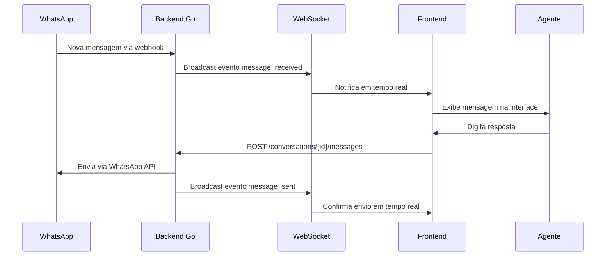

# 💬 Sistema de Conversas em Tempo Real

## Visão Geral

O sistema de conversas do PyTake oferece uma solução completa para gerenciar comunicações WhatsApp em tempo real, com interface moderna e funcionalidades avançadas de chat.

## 🏗️ Arquitetura

### Componentes Principais

```
Frontend (React/Next.js)
├── useWebSocket Hook           # Gerenciamento de conexão WebSocket
├── useConversations Hook       # Estado centralizado de conversas
├── ConversationsList           # Lista de conversas (/conversations)
└── ChatInterface               # Interface de chat individual (/conversations/[id])

Backend (Go)
├── WebSocket Server            # Servidor WebSocket para tempo real
├── Conversations API           # REST API para CRUD de conversas
├── Messages API                # REST API para mensagens
└── WhatsApp Webhook           # Recebimento de mensagens WhatsApp
```

### Fluxo de Dados



## 🔌 WebSocket Integration

### Conexão e Autenticação

```typescript
// Hook useWebSocket
const wsUrl = `${protocol}//${host}/api/v1/conversations/ws`
const ws = new WebSocket(wsUrl)

// Autenticação automática após conexão
ws.send(JSON.stringify({
  type: 'auth',
  token: authToken,
  user_id: userId
}))
```

### Eventos Suportados

| Evento | Descrição | Payload |
|--------|-----------|---------|
| `message_received` | Nova mensagem do cliente | `Message` object |
| `message_sent` | Mensagem enviada pelo agente | `Message` object |
| `message_status_updated` | Atualização de status | `{message_id, status, conversation_id}` |
| `conversation_updated` | Mudança na conversa | `Conversation` object |
| `typing_start` | Cliente digitando | `{conversation_id, contact_id}` |
| `typing_stop` | Cliente parou de digitar | `{conversation_id, contact_id}` |

### Auto-Reconexão

```typescript
// Configuração de reconexão automática
const options = {
  autoReconnect: true,
  reconnectInterval: 3000,
  maxReconnectAttempts: 5
}

// Implementação com backoff exponencial
setTimeout(() => {
  connect()
}, reconnectInterval * reconnectAttempts)
```

## 📝 API REST

### Endpoints de Conversas

#### GET /api/v1/conversations
Lista conversas com filtros e paginação.

**Query Parameters:**
- `status` - Filtrar por status (active, waiting, assigned, closed)
- `search` - Buscar por nome, telefone ou conteúdo
- `limit` - Quantidade de resultados (padrão: 50)
- `offset` - Offset para paginação

**Response:**
```json
[
  {
    "id": "uuid",
    "tenant_id": "uuid", 
    "contact_id": "uuid",
    "status": "active",
    "unread_count": 3,
    "last_message": "Olá, preciso de ajuda",
    "last_message_time": "2024-01-15T10:30:00Z",
    "contact": {
      "id": "uuid",
      "name": "João Silva",
      "phone": "+5511999999999"
    }
  }
]
```

#### GET /api/v1/conversations/{id}/messages
Lista mensagens de uma conversa específica.

**Query Parameters:**
- `limit` - Quantidade de mensagens (padrão: 100)
- `offset` - Offset para paginação
- `before` - Mensagens antes de uma data específica

**Response:**
```json
[
  {
    "id": "uuid",
    "conversation_id": "uuid",
    "sender_type": "contact",
    "content": "Olá, tudo bem?",
    "message_type": "text",
    "status": "read",
    "created_at": "2024-01-15T10:30:00Z"
  }
]
```

#### POST /api/v1/conversations/{id}/messages
Envia uma nova mensagem.

**Request Body:**
```json
{
  "content": "Olá! Como posso ajudar?",
  "message_type": "text",
  "metadata": {}
}
```

**Response:**
```json
{
  "id": "uuid",
  "conversation_id": "uuid",
  "sender_type": "agent",
  "content": "Olá! Como posso ajudar?",
  "message_type": "text",
  "status": "pending",
  "created_at": "2024-01-15T10:31:00Z"
}
```

## 🎨 Frontend Components

### useConversations Hook

Principal hook para gerenciar estado das conversas:

```typescript
const {
  // Estado
  conversations,          // Lista filtrada de conversas
  currentConversation,    // Conversa selecionada
  currentMessages,        // Mensagens da conversa atual
  isLoading,             // Estado de carregamento
  error,                 // Erros de API
  unreadCount,           // Total de não lidas
  isConnected,           // Status WebSocket
  
  // Filtros
  searchTerm,            // Termo de busca
  setSearchTerm,         // Setter para busca
  statusFilter,          // Filtro de status
  setStatusFilter,       // Setter para status
  
  // Ações
  loadConversations,     // Recarregar lista
  selectConversation,    // Selecionar conversa
  sendMessage,           // Enviar mensagem
  markAsRead            // Marcar como lida
} = useConversations()
```

### Lista de Conversas (/conversations)

Funcionalidades principais:
- ✅ Lista em tempo real com WebSocket
- ✅ Filtros por status (Todas, Ativas, Aguardando, Atribuídas)
- ✅ Busca por nome, telefone ou conteúdo
- ✅ Indicadores de conexão e mensagens não lidas
- ✅ Auto-refresh quando WebSocket desconectado
- ✅ Tratamento de erros com retry

### Interface de Chat (/conversations/[id])

Funcionalidades principais:
- ✅ Carregamento automático de mensagens
- ✅ Envio de mensagens em tempo real
- ✅ Estados visuais de entrega (pending/sent/delivered/read)
- ✅ Auto-scroll para novas mensagens
- ✅ Indicadores de digitação
- ✅ Fallback para modo offline

## 🔧 Configuração e Setup

### Variáveis de Ambiente

```bash
# Backend
WEBSOCKET_ENABLED=true
WEBSOCKET_PORT=8080
WEBSOCKET_PATH=/api/v1/conversations/ws

# Frontend
NEXT_PUBLIC_API_URL=http://localhost:8080
NEXT_PUBLIC_WS_URL=ws://localhost:8080
```

### Configuração do WebSocket Server (Go)

```go
// Configuração do servidor WebSocket
func setupWebSocket(r *gin.Engine) {
    r.GET("/api/v1/conversations/ws", func(c *gin.Context) {
        websocket.Handler(func(ws *websocket.Conn) {
            handleWebSocketConnection(ws)
        }).ServeHTTP(c.Writer, c.Request)
    })
}

// Handler de conexões
func handleWebSocketConnection(ws *websocket.Conn) {
    // Autenticação
    // Registro da conexão
    // Loop de mensagens
    // Cleanup na desconexão
}
```

### Configuração do Cliente (React)

```typescript
// Configuração automática baseada no ambiente
const getWebSocketUrl = () => {
  const protocol = window.location.protocol === 'https:' ? 'wss:' : 'ws:'
  const host = window.location.hostname === 'localhost' 
    ? 'localhost:8080' 
    : 'api.pytake.net'
  return `${protocol}//${host}/api/v1/conversations/ws`
}
```

## 🚀 Deployment

### Produção com SSL

```nginx
# Configuração Nginx para WebSocket
location /api/v1/conversations/ws {
    proxy_pass http://backend:8080;
    proxy_http_version 1.1;
    proxy_set_header Upgrade $http_upgrade;
    proxy_set_header Connection "upgrade";
    proxy_set_header Host $host;
    proxy_set_header X-Real-IP $remote_addr;
    proxy_set_header X-Forwarded-For $proxy_add_x_forwarded_for;
    proxy_set_header X-Forwarded-Proto $scheme;
}
```

### Docker Compose

```yaml
services:
  backend:
    environment:
      - WEBSOCKET_ENABLED=true
      - WEBSOCKET_ALLOWED_ORIGINS=https://app.pytake.net
    ports:
      - "8080:8080"
      
  frontend:
    environment:
      - NEXT_PUBLIC_WS_URL=wss://api.pytake.net
```

## 🧪 Testing

### Testes de WebSocket

```javascript
// Teste de conexão
describe('WebSocket Connection', () => {
  test('should connect and authenticate', () => {
    const ws = new WebSocket(wsUrl)
    ws.onopen = () => {
      ws.send(JSON.stringify({type: 'auth', token: 'test'}))
    }
    // Asserções...
  })
})
```

### Testes de API

```javascript
// Teste de envio de mensagem
describe('Messages API', () => {
  test('should send message successfully', async () => {
    const response = await api.post('/conversations/123/messages', {
      content: 'Test message',
      message_type: 'text'
    })
    expect(response.status).toBe(200)
  })
})
```

## 📊 Monitoramento

### Métricas WebSocket

- Conexões ativas
- Mensagens por segundo
- Latência média
- Taxa de reconexão
- Erros de autenticação

### Logs Importantes

```go
// Logs do servidor WebSocket
log.Info("WebSocket connection established", "user_id", userID)
log.Error("WebSocket authentication failed", "error", err)
log.Debug("Broadcasting message", "event", event, "users", userCount)
```

### Health Checks

```bash
# Verificar status do WebSocket
curl -I -N -H "Connection: Upgrade" \
     -H "Upgrade: websocket" \
     -H "Sec-WebSocket-Key: test" \
     -H "Sec-WebSocket-Version: 13" \
     https://api.pytake.net/api/v1/conversations/ws
```

## 🔍 Troubleshooting

### Problemas Comuns

1. **WebSocket não conecta**
   - Verificar firewall/proxy
   - Validar certificados SSL
   - Checar CORS headers

2. **Mensagens não aparecem em tempo real**
   - Verificar conexão WebSocket
   - Validar autenticação
   - Checar broadcast de eventos

3. **Auto-reconexão não funciona**
   - Verificar implementação de retry
   - Validar limites de tentativas
   - Checar intervalos de reconexão

### Debug do WebSocket

```javascript
// Debug detalhado no frontend
const ws = useWebSocket({
  onConnect: () => console.log('WS Connected'),
  onDisconnect: () => console.log('WS Disconnected'),
  onMessage: (msg) => console.log('WS Message:', msg),
  onError: (err) => console.error('WS Error:', err)
})
```