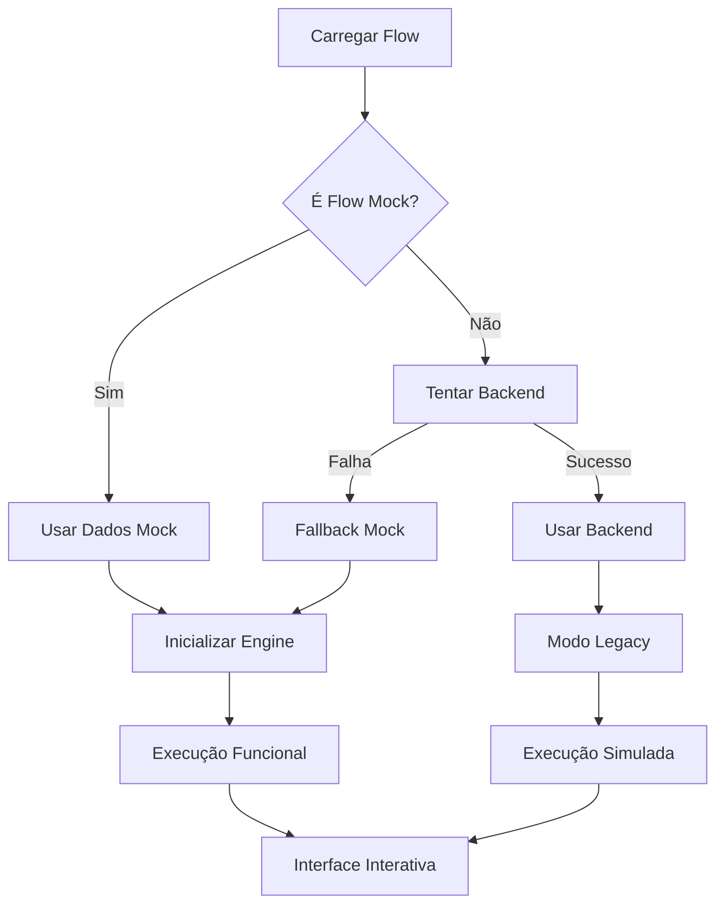

# Sistema Mock Completo - PyTake Flow Testing

## 📖 Visão Geral

Este sistema mock permite testar flows de forma completamente offline, com execução funcional de diferentes tipos de nós. O sistema foi projetado para funcionar como fallback automático quando o backend não estiver disponível.

## 🚀 Recursos Implementados

### ✅ Flow "Boas-vindas Automáticas" Completo
- **ID**: `a4ac6fc3-ad2d-4125-81fa-9685b88697fc`
- **Trigger**: Palavras-chave (oi, olá, hello, start, começar, ajuda, menu)
- **Navegação**: Menu interativo com botões e listas
- **Fluxos**: Informações, Suporte, Produtos com sub-fluxos

### 🔧 Tipos de Nós Suportados

#### Triggers
- `trigger_keyword` - Ativação por palavras-chave

#### Mensagens
- `message` - Envio de mensagens de texto com formatação WhatsApp
- `buttons` - Botões interativos clicáveis
- `interactive_list` - Listas com múltiplas opções

#### Lógica
- `input` - Captura de entrada do usuário com validação
- `switch` - Redirecionamento baseado em variáveis
- `condition` - Avaliação de condições lógicas

#### Dados
- Sistema completo de variáveis com interpolação `{{variavel}}`

### 🎯 Funcionalidades do Sistema

#### Execução Funcional
- ✅ Navegação real entre nós baseada em condições
- ✅ Processamento de variáveis dinâmicas
- ✅ Aguardar entrada do usuário (input, buttons, lists)
- ✅ Simulação de delay/typing
- ✅ Logs detalhados de execução

#### Interface WhatsApp
- ✅ Design responsivo idêntico ao WhatsApp
- ✅ Botões interativos com descrições
- ✅ Listas interativas organizadas
- ✅ Indicador de digitação
- ✅ Status de aguardando entrada

#### Console de Debug
- ✅ Logs em tempo real com timestamps
- ✅ Monitoramento de variáveis
- ✅ Caminho de execução visual
- ✅ Breakpoints funcionais
- ✅ Informações do flow

## 📱 Como Usar

### 1. Acessar o Flow de Teste
```
http://localhost:3000/flows/a4ac6fc3-ad2d-4125-81fa-9685b88697fc/test
```

### 2. Modos de Operação

#### Modo Mock (Automático)
- Sistema detecta automaticamente se é flow mock
- Fallback automático se backend indisponível
- Execução completamente offline

#### Modo Backend
- Usa API real quando disponível
- Execução legacy mantida para compatibilidade

### 3. Interação com o Flow

#### Iniciar Flow
1. Clique em "Iniciar" no painel de debug
2. Ou digite uma palavra-chave: `oi`, `olá`, `menu`, `ajuda`

#### Navegação
- **Botões**: Clique diretamente nos botões das mensagens
- **Listas**: Selecione itens das listas interativas  
- **Input**: Digite texto quando solicitado
- **Texto Livre**: Digite `menu` para voltar ao início

#### Debug
- **Logs**: Acompanhe execução em tempo real
- **Variáveis**: Monitore valores das variáveis
- **Breakpoints**: Pause execução em nós específicos
- **Caminho**: Visualize percurso da execução

## 🏗 Arquitetura

### Arquivos Principais

#### `/lib/mock/flow-test-data.ts`
- Dados mock do flow "Boas-vindas Automáticas"
- Estrutura completa com nós, edges e configurações
- Funções helper para verificação de flows mock

#### `/lib/mock/flow-execution-engine.ts`
- Engine de execução funcional
- Handlers para todos os tipos de nós
- Sistema de callbacks para UI
- Gerenciamento de estado de execução

#### `/app/flows/[id]/test/page.tsx`
- Interface principal do teste
- Integração entre sistema mock e UI
- Fallback automático backend/mock
- Console de debug completo

### Fluxo de Execução



## 🔧 Desenvolvimento

### Adicionar Novos Flows Mock

1. **Criar dados em `flow-test-data.ts`:**
```typescript
export const MOCK_NEW_FLOW: MockFlow = {
  id: "novo-flow-id",
  name: "Meu Novo Flow",
  // ... estrutura completa
}
```

2. **Atualizar funções helper:**
```typescript
export function getMockFlowById(id: string): MockFlow | null {
  if (id === MOCK_WELCOME_FLOW.id) return MOCK_WELCOME_FLOW
  if (id === "novo-flow-id") return MOCK_NEW_FLOW
  return null
}
```

### Adicionar Novos Tipos de Nós

1. **Implementar handler em `flow-execution-engine.ts`:**
```typescript
case 'novo_tipo_no':
  nextNodeId = await this.handleNovoTipoNo(node)
  break
```

2. **Criar método handler:**
```typescript
private async handleNovoTipoNo(node: MockFlowNode): Promise<string | null> {
  // Lógica do nó
  return this.findNextNode(node.id)
}
```

## 🐛 Debug e Testes

### Problemas Comuns

#### Flow não carrega
- ✅ Verificar se ID está em `isMockFlow()`
- ✅ Conferir estrutura do flow mock
- ✅ Verificar console do navegador

#### Nó não executa
- ✅ Tipo de nó está implementado?
- ✅ Handler está no switch case?
- ✅ Edges estão corretos?

#### Variáveis não interpolam
- ✅ Formato correto: `{{nome.variavel}}`
- ✅ Variável existe no contexto?
- ✅ Processamento está sendo chamado?

### Logs Úteis

Todos os logs aparecem no console de debug:
- 🔵 **running**: Nó em execução
- 🟢 **success**: Nó executado com sucesso  
- 🔴 **error**: Erro na execução
- 🟡 **waiting**: Aguardando entrada do usuário
- ⚪ **skipped**: Nó pulado

## 🎉 Exemplo de Uso Completo

1. **Acesse**: `http://localhost:3000/flows/a4ac6fc3-ad2d-4125-81fa-9685b88697fc/test`

2. **Teste o Flow Completo**:
   ```
   [Usuário] oi
   [Bot] 👋 Olá Usuário Teste! Bem-vindo ao PyTake!...
   [Bot] 🏠 Menu Principal - Escolha uma das opções abaixo:
         [📋 Informações] [🆘 Suporte] [🛍️ Produtos]
   
   [Usuário] clica em "🛍️ Produtos"
   [Bot] Lista de produtos com planos...
   
   [Usuário] seleciona "plan_pro"  
   [Bot] 💼 Plano Professional - Detalhes completos...
   
   [Usuário] clica em "🏠 Voltar ao Menu"
   [Bot] Menu principal novamente...
   ```

3. **Monitore no Debug**:
   - Logs de cada nó executado
   - Variáveis atualizadas em tempo real
   - Caminho de execução visual
   - Breakpoints funcionais

## 📈 Benefícios

- 🚀 **Desenvolvimento Offline**: Teste sem backend
- 🔄 **Fallback Automático**: Zero configuração
- 🎯 **Execução Real**: Não apenas simulação
- 🐛 **Debug Avançado**: Console completo
- 📱 **Interface Realista**: WhatsApp-like
- 🔧 **Extensível**: Fácil adicionar flows/nós

---

**Sistema implementado com sucesso! 🎉**
Pronto para desenvolvimento e teste de flows offline com execução funcional completa.